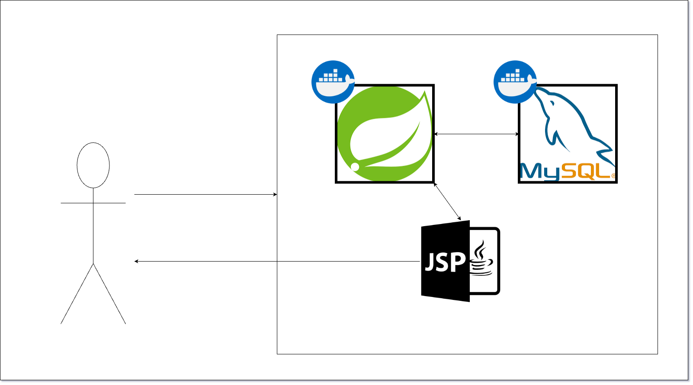

# File Extension Blocker

파일 확장자에 따라 특정 형식의 파일을 첨부하거나 전송하지 못하도록 제한

<!-- TOC -->
* [File Extension Blocker](#file-extension-blocker)
  * [사용 방법](#사용-방법)
  * [실행 방법](#실행-방법)
    * [Docker Compose 실행](#docker-compose-실행)
    * [Docker Compose 중지](#docker-compose-중지)
  * [화면](#화면)
    * [1. 홈 화면](#1-홈-화면)
    * [2. 설정 화면](#2-설정-화면)
  * [프로젝트 구조](#프로젝트-구조)
    * [1. file tree](#1-file-tree)
    * [structure](#structure)
  * [프로젝트 특징](#프로젝트-특징)
    * [1. 확장자 관리 정책 (Fixed / Custom)](#1-확장자-관리-정책-fixed--custom)
    * [2. 도메인 중심 비즈니스 로직](#2-도메인-중심-비즈니스-로직)
    * [3. 로깅 및 운영 추적](#3-로깅-및-운영-추적)
    * [4. 개발·배포 환경 구성](#4-개발배포-환경-구성)
    * [5. 서버 사이드 렌더링 UI](#5-서버-사이드-렌더링-ui)
<!-- TOC -->

## 사용 방법

1. 파일 확장자 제한 설정: 설정 파일에서 원하는 파일 확장자를 추가하거나 제거하여 제한을 설정합니다.
2. 파일 첨부/전송 제한: 파일을 첨부하거나 전송할 때 파일 확장자를 확인하여 제한된 파일 형식인지 확인합니다.

## 실행 방법

### Docker Compose 실행

```shell
docker compose -f compose-prod.yml up
```

### Docker Compose 중지

```shell
docker compose -f compose-prod.yml down
```

## 화면

### 1. 홈 화면


### 2. 설정 화면


## 프로젝트 구조

### 1. file tree

```text
.
├── Dockerfile
├── build.gradle
├── compose-infra.yml
├── compose-prod.yml
├── gradlew
├── settings.gradle
└── src/
    ├── main/
    │   ├── java/com/regular/fileextensionblocker/
    │   │   ├── aop/                 # AOP 관련 (로깅 등)
    │   │   ├── controller/          # API 및 페이지 컨트롤러
    │   │   ├── domain/              # 엔티티 및 공통 타입
    │   │   ├── dto/                 # 데이터 전송 객체
    │   │   ├── exception/           # 커스텀 예외 및 예외 핸들러
    │   │   ├── filter/              # 서블릿 필터 (MDC 등)
    │   │   ├── repository/          # 데이터 액세스 계층
    │   │   └── service/             # 비즈니스 로직 계층
    │   ├── resources/
    │   │   ├── application.yml      # 기본 설정
    │   │   └── logback-spring.xml   # 로그 설정
    │   └── webapp/WEB-INF/views/    # JSP 뷰 파일
    └── test/
        └── java/com/regular/fileextensionblocker/ # 테스트 코드
```

### structure



## 프로젝트 특징

### 1. 확장자 관리 정책 (Fixed / Custom)

- 이원화된 확장자 관리
    - 고정 확장자 (FIXED)
      bat, cmd, exe, scr, js 등 보안상 자주 차단되는 확장자를 사전 정의하고,
      체크박스를 통해 차단 여부를 변경할 수 있습니다.
    - 커스텀 확장자 (CUSTOM)
      사용자가 직접 확장자를 추가할 수 있으며, 최대 200개로 제한하여
      무분별한 등록을 방지합니다.

- 입력 데이터 정규화
    - ExtensionNormalizer를 통해 공백 제거, 소문자 변환, 선행 도트(.) 제거를 수행하여
      확장자 데이터의 일관성을 유지합니다.

### 2. 도메인 중심 비즈니스 로직

- 도메인 규칙의 엔티티 캡슐화
    - FileExtensionPolicy 엔티티에서 정적 팩토리 메서드(fixed, custom)를 제공합니다.
    - 커스텀 확장자의 차단 여부 수정 불가와 같은 핵심 규칙을
      엔티티 내부에서 검증합니다.

- 예외 설계
    - DuplicateExtensionException, CustomLimitExceededException,
      InvalidExtensionException 등 상황별 예외를 정의합니다.
    - GlobalExceptionHandler를 통해 모든 예외를
      일관된 응답 형식으로 반환합니다.

- 초기 데이터 자동 구성
    - FixedExtensionSeeder가 애플리케이션 기동 시
      필수 고정 확장자 데이터를 자동으로 생성합니다.

### 3. 로깅 및 운영 추적

- AOP 기반 메서드 로깅
    - LoggingAspect를 통해 컨트롤러·서비스 계층의
      호출 인자와 실행 시간을 자동으로 기록합니다.
    - 호출 빈도가 높은 로직은 TRACE 레벨로 분리하여
      로그 과다 발생을 방지합니다.

- 요청 단위 추적 (MDC)
    - MdcFilter에서 요청마다 traceId를 생성합니다.
    - 모든 로그에 traceId를 포함하고,
      응답 헤더(X-Trace-Id)로 함께 전달하여
      장애 분석 시 추적성을 확보합니다.

### 4. 개발·배포 환경 구성

- 멀티 데이터베이스 지원
    - 로컬 환경에서는 H2,
      운영 환경에서는 MySQL을 사용하도록 구성했습니다.

- 컨테이너 기반 실행
    - Dockerfile과 Docker Compose 설정을 제공하여
      인프라 구성과 실행 환경을 코드로 관리합니다.

### 5. 서버 사이드 렌더링 UI

- JSP 기반 화면 구성
    - JSP와 JSTL을 사용하여 간단한 관리 UI를 제공합니다.